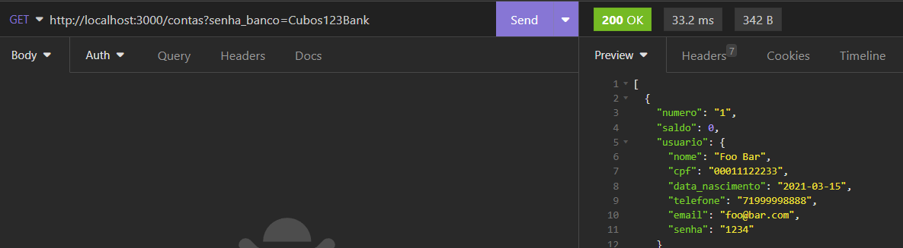
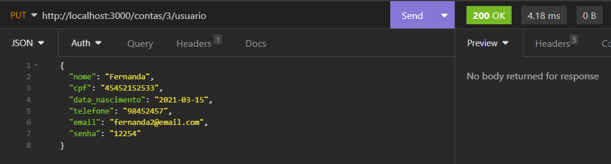
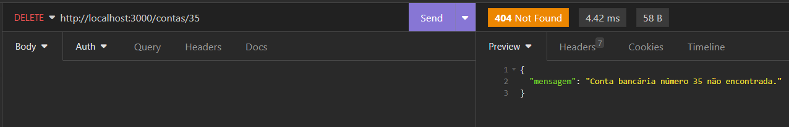
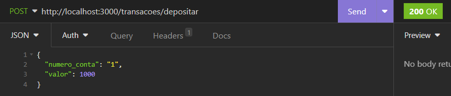
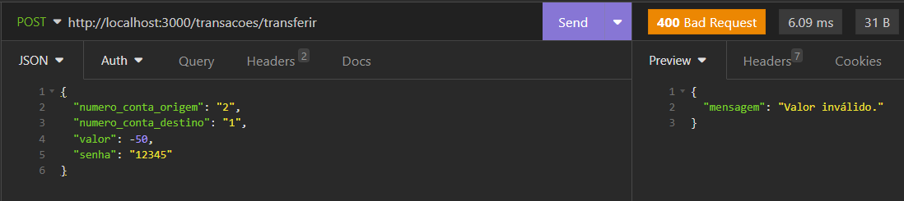
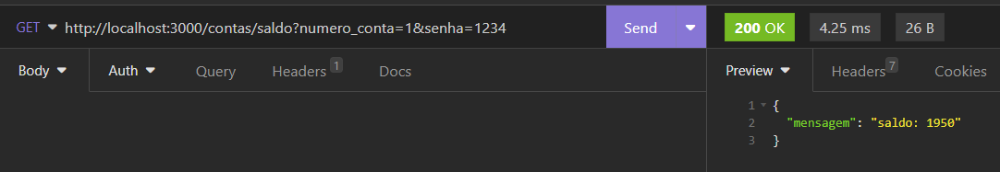
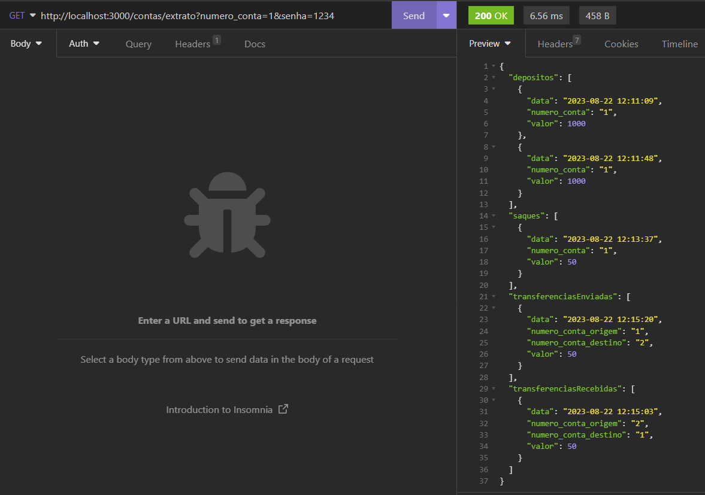
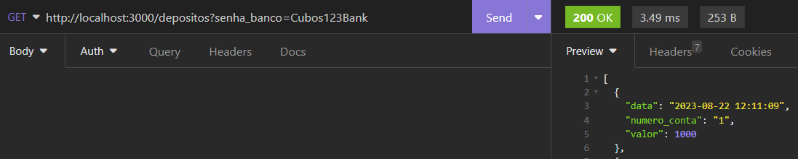
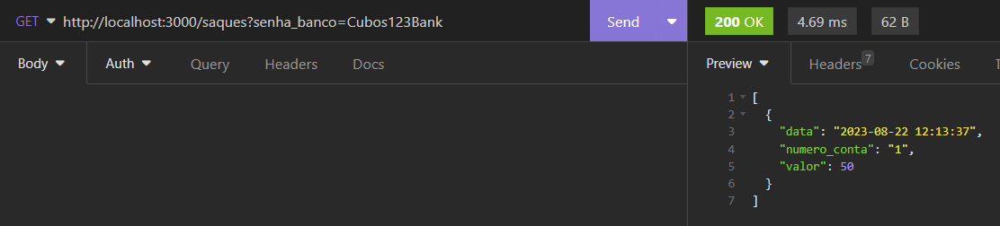
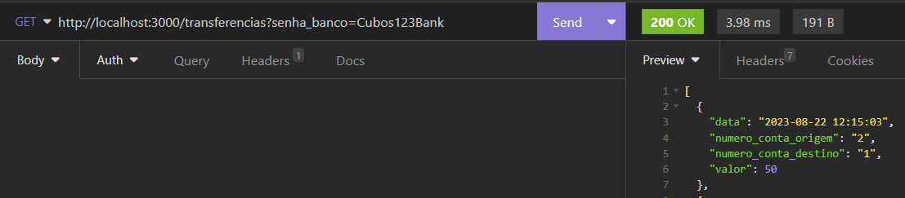

<h1 align="center"> 
	API Banco Digital 
</h1>

<p align="center">
	

 </p>

<p align="center">
 <a href="#coin-sobre-o-projeto">Sobre</a> •
 <a href="#gear-funcionalidades">Funcionalidades</a> •
 <a href="#dizzy-pré-requisitos">Pré Requisitos</a> • 
 <a href="#robot-rodando-o-backend-servidor">Rodando o backend</a> • 
 <a href="#arrow_forward-executando-o-projeto">Executando o projeto</a> • 
 <a href="#computer-testando-a-api">Testando a API</a> •
 <a href="#autor">Autor</a> • 
</p>


## :coin: Sobre o projeto

O piloto de uma API de banco digital desenvolvida em JavaScript, focada no backend, que oferece funcionalidades completas para gerenciar contas bancárias e realizar operações financeiras.

---  

## :gear: Funcionalidades

- Listar contas bancárias
- Atualizar usuário da conta bancária
- Excluir Conta
- Depositar
- Sacar
- Transferir
- Saldo
- Extrato
- Listar saques
- Listar depósitos
- Listar transferências

---

## :dizzy: Pré-requisitos
 
Antes de começar, você vai precisar ter instalado em sua máquina as seguintes ferramentas:
[Git](https://git-scm.com), [Node.js](https://nodejs.org/en/). 
Além disto é bom ter um editor para trabalhar com o código como [VSCode](https://code.visualstudio.com/)

---

## :robot: Rodando o Backend (servidor)

```bash
# Clone este repositório
$ git clone <https://github.com/fcharbel/api-banco-digital>

# Navegue até o diretório do projeto:
$ cd api-banco-digital

# Instale as dependências
$ npm install

# Execute a aplicação em modo de desenvolvimento
$ npm run dev

# O servidor inciará na porta:3000 - acesse <http://localhost:3000>
```
--- 

## :arrow_forward: Executando o Projeto

Para iniciar o servidor e começar a utilizar a API, você pode executar o seguinte comando:

```bash
npm run dev
```
O servidor será iniciado utilizando o Nodemon, o que permite que você faça alterações no código sem precisar reiniciar manualmente o servidor.

## :computer: Testando a API
Para testar a API, você pode usar o [Insomnia](https://insomnia.rest/download), que é uma plataforma para testar e documentar APIs. 


###  🔗 Criar conta bancária: 
#### `POST` `/contas`
Faz a listagem de todas as contas bancárias do banco, mediante senha informada (passada como query params na url).



### 🔗 Atualizar usuário da conta bancária

#### `PUT` `/contas/:numeroConta/usuario`

Atualiza os dados de usuário de uma conta bancária. 



### 🔗 Excluir Conta

#### `DELETE` `/contas/:numeroConta`

Esta funcionalidade exclui uma conta bancária existente.



### 🔗 Depositar

#### `POST` `/transacoes/depositar`

Soma o valor do depósito ao saldo de uma conta válida e registra essa transação.



### 🔗 Sacar

#### `POST` `/transacoes/sacar`

Realiza o saque de um valor em uma determinada conta bancária e registra essa transação.


### 🔗 Tranferir

#### `POST` `/transacoes/transferir`

Permite a transferência de recursos (dinheiro) de uma conta bancária para outra e registra essa transação.



### 🔗 Saldo

#### `GET` `/contas/saldo?numero_conta=123&senha=123`

Esta funcionalidade retorna o saldo de uma conta bancária. Na url deverá ser passados os seguintes query params:




### 🔗 Extrato

#### `GET` `/contas/extrato?numero_conta=123&senha=123`

Lista todas as transações realizadas de uma conta específica. 




### 🔗 Listar depósitos

#### `GET` `/depositos?senha_banco=Cubos123Bank`

Faz a listagem de todos os depósitos realizados no banco, mediante senha informada (passada como query params na url).



### 🔗 Listar saques

#### `GET` `/saques?senha_banco=Cubos123Bank`

Faz a listagem de todos os saques realizados no banco, mediante senha informada (passada como query params na url).




### 🔗 Listar transferências

#### `GET` `/transferencias?senha_banco=Cubos123Bank`

Faz a listagem de todos as transferências realizadas no banco, mediante senha informada (passada como query params na url).




### 📝 Observações
Certifique-se de que as bibliotecas utilizadas, como ```express```, ```nodemon```, e ```date-fns```, estão sendo instaladas automaticamente pelo comando ```npm install```. Caso contrário, verifique se elas estão listadas corretamente no arquivo ```package.json``` sob a seção ```dependencies```.

---

## 🤝 Como contribuir para o projeto

1. Faça um **fork** do projeto.
2. Crie uma nova branch com as suas alterações: `git checkout -b my-feature`
3. Salve as alterações e crie uma mensagem de commit contando o que você fez: `git commit -m "feature: My new feature"`
4. Envie as suas alterações: `git push origin my-feature`


---

##  Autor

<a href="https://www.linkedin.com/in/fernanda-charbel/">
 
 <br />
 <sub><b>Fernanda Charbel</b></sub></a> <a href="https://www.linkedin.com/in/fernanda-charbel/" title=""> 🌺 </a>
 <br />

